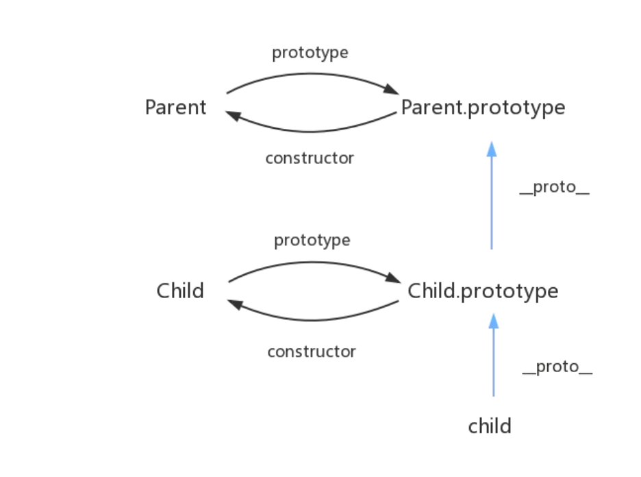
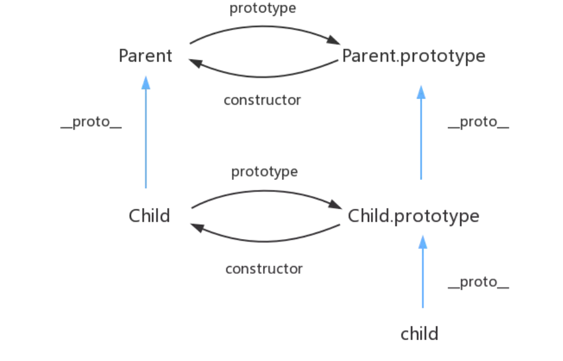

### 原型链继承
> 原型链继承的缺点
> + 所有实例共享了父类的属性
> + 子类无法向父类传参
```typescript
  function Parent() {
    this.name='name';
  }
  Parent.prototype.getName=function() {
    return this.name;
  };
  function Child() {}
  Child.prototype=new Parent();
  let child1=new Child();
```
### 构造函数继承
> 构造函数继承的缺点  
> 构造函数继承实则是子类实例拷贝父类属性来实现继承  这种以空间换时间的方式与JS原型链的思想是相违背的
```typescript
  function Parent() {
    this.name=[];
  }
  function Child() {
    Parent.call(this);
  }
```
### 组合继承
> 组合继承优点整合了原型链继承和构造函数继承的特点缺点是  
> 父类构造函数调用了两次 占据了额外的内存
```typescript
function Parent() {
  this.name=''
}
Parent.prototype.getName=function() {
  return this.name;
};
function Child() {
  Parent.call(this);
}
Child.prototype=new Parent();
Child.prototype.constructor=Child;
```
### 寄生组合继承
> 这种方式高效率体现他只调用了一次父类构造函数,并且避免了在父类原型上创建不必要的多余的属性
> 与此同时,原型链还能保持不变因此能够正常使用instanceof来判断类型 开发人员普遍认为寄生组合继承
> 是目前最理想的继承方式
```typescript
function Parent() {
  this.name=''
}
Parent.prototype.getName=function() {
  return this.name;
};
function Child() {
  Parent.call(this);
}
function extends1(Child,Parent) {
  Child.prototype=Object.create(Parent.prototype);
  Child.prototype.constructor=Child;
}
```

### es6继承
> 相比寄生组合继承,es6继承
> + 子类声明的函数是不可枚举的
> + 子类没有自己的this,必须调用super函数继承分裂的this
> + 多了object.setProtoType这一步操作也就是子类的proto指向父类


```typescript
/**
 * @description 在typeof基础上扩展了symbol类型的判断兼容
 * @param obj 要判断的对象
 * @return 返回判断后的类型
 * */
function _typeof(obj:any) {
  let _typeof;
  if (typeof Symbol === "function" && typeof Symbol.iterator === "symbol") {
     _typeof = function _typeof(obj:any) {
      return typeof obj;
    };
  } else {
    _typeof = function _typeof(obj:any) {
      return obj && typeof Symbol === "function" && obj.constructor === Symbol && obj !== Symbol.prototype ? "symbol" : typeof obj;
    };
  }
  return _typeof(obj);
}
/**
 * @description 判断父类构造函数返回的结果来决定this的取值
 * @param self 子类的this
 * @param call 父类构造函数返回的结果
 * @return this最终的取值
 * */
function _possibleConstructorReturn(self:any, call:any) {
  if (call && (_typeof(call) === "object" || typeof call === "function")) {
    return call;
  }
  return _assertThisInitialized(self);
}
/**
 * @description 判断this是否为undefined
 * */
function _assertThisInitialized(self:any) {
  if (self === void 0) {
    throw new ReferenceError("this hasn't been initialised - super() hasn't been called");
  }
  return self;
}
/**
 * @description 获取对象的原型
 * */
function _getPrototypeOf(o:any) {
  const _getPrototypeOf = Object.setPrototypeOf ? Object.getPrototypeOf : function _getPrototypeOf(o:any) {
    return o.__proto__ || Object.getPrototypeOf(o);
  };
  return _getPrototypeOf(o);
}
/**
 * @description 核心继承方法
 * */
function _inherits(subClass:any, superClass:any) {
  if (typeof superClass !== "function" && superClass !== null) {
    throw new TypeError("Super expression must either be null or a function");
  }
  subClass.prototype = Object.create(superClass && superClass.prototype, {
    constructor: {
      value: subClass,
      writable: true,
      configurable: true
    }
  });
  if (superClass) _setPrototypeOf(subClass, superClass);
}
/**
 * @description 设置对象的原型
 * */
function _setPrototypeOf(o:any, p:any) {
  const _setPrototypeOf = Object.setPrototypeOf || function _setPrototypeOf(o, p) {
    o.__proto__ = p;
    return o;
  };
  return _setPrototypeOf(o, p);
}
/**
 * @description instance实现
 * */
function _instanceof(left, right) {
  if (right != null && typeof Symbol !== "undefined" && right[Symbol.hasInstance]) {
    return !!right[Symbol.hasInstance](left);
  } else {
    return left instanceof right;
  }
}
/**
 * @description class只能new调用
 * */
function _classCallCheck(instance:any, Constructor:any) {
  if (!_instanceof(instance, Constructor)) {
    throw new TypeError("Cannot call a class as a function");
  }
}
var Parent = function Parent(this:any,name:string) {
  _classCallCheck(this, Parent);
  this.name = name;
};

var Child =
  /*#__PURE__*/
  function (_Parent) {
    _inherits(Child, _Parent);

    function Child(name, age) {
      var _this;
      _classCallCheck(this, Child);
      _this = _possibleConstructorReturn(this, _getPrototypeOf(Child).call(this, name)); // 调用父类的 constructor(name)

      _this.age = age;
      return _this;
    }

    return Child;
  }(Parent);

var child1 = new Child('kevin', '18');

```
