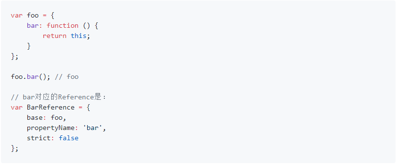

### 谈谈 this 概念

> 在 JS 中 this 属性存在于上下文中,而上下文呢是用到的时候才生成上下文 所以 this 属性动态的 this  
> 从开发者的角度来说可以从绑定规则的角度来理解 this
>
> - 默认绑定,全局函数,嵌套函数,sentiment 等函数中的 this 非严格模式下是全局对象而严格模式下会是 undefined
> - 隐式绑定,对象中的函数中的 this 会默认绑定这个对象,构造函数中的 this 会默认绑定通过 new 生成的对象实例
> - 显示绑定 通过 call apply bind 等方法绑定 this 对象
> - 箭头函数中的 this 是继承他上层作用域中的 this

### 从 ES 底层规范谈谈 this

> 在 ES 中除了我们常用的 null,undefined,object 等这些语言类型,还存在一些规范类型  
> 所谓规范类型是指存在于规范中,能够更好的描述语言的底层逻辑规范存在的,并不存在 JS 编码中  
> 要搞清楚 this 的计算规则 我们就要说说规范类型中的 reference 这个类型  
> reference 类型主要由三部分构成
>
> - base value --属性声明所在的对象(上下文)或者 environmentRecord--undefined, an Object, a Boolean, a String, a Number, or an environment record
> - referencedName --属性的名称
> - strict reference --严格模式  
>     
>   何时会生成 reference 类型
> - 标识符解析
> - 属性访问
> - 使用未声明的变量  
>   reference 类型提供了哪些 API
> - GetBase() 获取 reference 的 base value
> - isPropertyReference() base value 为对象的话会返回 true
> - getValue() 获取 reference 类型原生的值而不是类型  
>   this 值的算法
> - 计算 memberExpression 的值并赋值给 ref memberExpression 是睡醒访问表达式即()左边的部分
> - 如果 ref 是 reference 类型,并且 isPropertyReference 为 true,呢么 this 的值为 GetBase()
> - 如果 ref 是 reference 类型,并且 base value 的值为 environmentRecord 呢么 this 的值为 implicitThisValue()
> - 如果 ref 不是 reference 类型 呢么 this 的值为全局对象 严格模式下为 undefined
